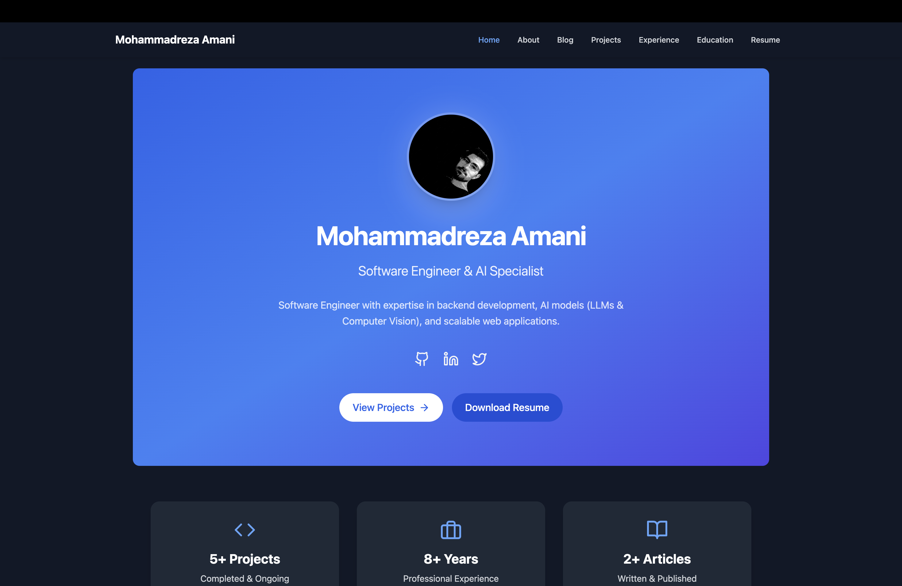
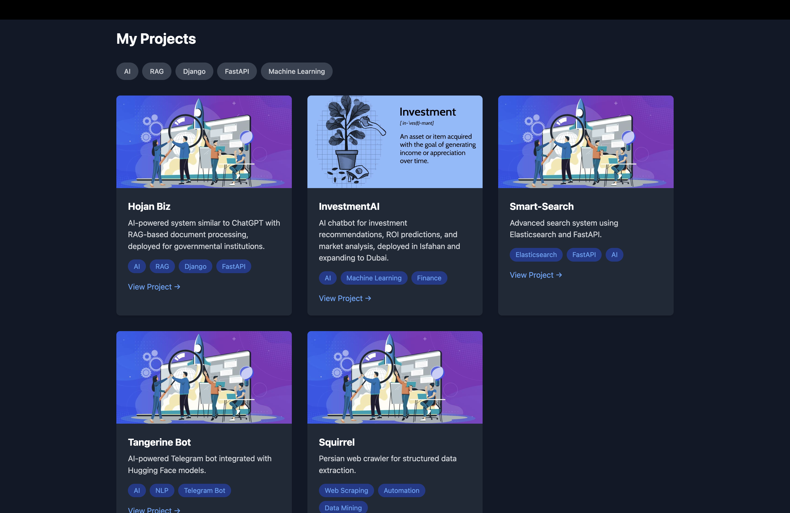
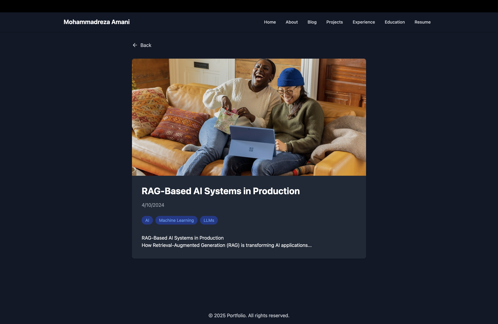

# Personal Portofilo Template

> [!TIP]
> **[Live Demo](https://mohammadrezaamani.github.io/)**

A lightweight, beautiful, and fully customizable portfolio website built with React and seamlessly integrated with GitHub. Whether you're a developer, designer, or professional looking to showcase your skills, projects, and experience, this template has got you covered! With its sleek design, theme support, and modular structure, you can tweak everything to match your personal style in minutes.

## Features

- **Lightweight & Fast**: Built with performance in mind using React.
- **Customizable**: Easily modify themes, layouts, and content to reflect your personality.
- **Sections Included**: Home, About Me, Blog, Projects, Education, and Resume.
- **Responsive Design**: Looks stunning on all devices – desktops, tablets, and phones.
- **Pretty by Default**: Clean typography and modern aesthetics out of the box.

---

## Getting Started

### Prerequisites

- Node.js (v16 or higher)
- bun, npm or yarn
- A GitHub account (optional, for hosting or fetching data)

### Installation

1. **Clone the Repository**

   ```bash
   git clone https://github.com/MohammadrezaAmani/personal_website_template.git
   cd personal_website_template
   ```

2. **Install Dependencies**

   ```bash
   npm install
   # OR
   bun install
   # OR
   yarn install
   ```

3. **Run Locally**

   ```bash
   npm run dev
   # OR
   bun run dev
   # OR
   yarn run dev
   ```

   Open `http://localhost:5173` in your browser to see the magic happen!

4. **Build for Production**

   ```bash
   npm run build
   # OR
   bun run build
   # OR
   yarn run build
   ```

---

## Customizing Your Resume

The template is powered by a single configuration file where you define all your data. It’s written in typescript and uses a modular structure for easy updates.

### Configuration File

Create a file (e.g., `src/data.ts`) and export your data like this:

```typescript
import {
  Database,
  Flame,
  Github,
  Linkedin,
  Twitter,
  Wrench,
} from "lucide-react";

export default {
  site_name: "Your Name",
  footer_note: `© ${new Date().getFullYear()} Portfolio. All rights reserved.`,
  default_project_image: "path/to/default/project-image.jpg",
  default_blog_image: "path/to/default/blog-image.jpg",
  default_user_image: "path/to/default/user-image.jpg",
  tags_limit: 5,

  about: {
    name: "Your Name",
    title: "Your Job Title",
    bio: "A short bio about yourself.",
    image: "path/to/your-profile-pic.jpg",
    social: [
      {
        name: "github",
        url: "https://github.com/[YourUsername]",
        icon: Github,
      },
      {
        name: "linkedin",
        url: "https://linkedin.com/in/[YourUsername]",
        icon: Linkedin,
      },
      {
        name: "twitter",
        url: "https://twitter.com/[YourUsername]",
        icon: Twitter,
      },
    ],
    skills: [
      {
        icon: Wrench,
        category: "Languages",
        technologies: ["JavaScript", "Python"],
      },
      {
        icon: Flame,
        category: "Frameworks",
        technologies: ["React", "Node.js"],
      },
      {
        icon: Database,
        category: "Databases",
        technologies: ["MongoDB", "PostgreSQL"],
      },
    ],
    interests: ["Hiking", "Coding", "Coffee"],
  },

  experience: [
    {
      id: 1,
      company: "Company Name",
      position: "Job Title",
      period: "2020 – Present",
      description: "What you did there.",
      achievements: ["Achievement 1", "Achievement 2"],
    },
  ],

  education: [
    {
      id: 1,
      institution: "University Name",
      degree: "Degree Name",
      period: "2016 – 2020",
      description: "What you studied.",
    },
  ],

  projects: [
    {
      id: 1,
      title: "Project Name",
      description: "What it does.",
      tags: ["React", "AI"],
      image: "path/to/project-image.jpg",
      link: "https://github.com/[YourUsername]/[ProjectRepo]",
    },
  ],

  blog: [
    {
      id: 1,
      title: "Blog Post Title",
      date: "2024-01-01",
      content: "# Your markdown content here...",
      tags: ["Tech", "AI"],
      image: "path/to/blog-image.jpg",
    },
  ],
};
```

### How to Customize

1. **Update Personal Info**: Edit `about` with your name, title, bio, and social links.
2. **Add Experience**: List your jobs in `experience` with achievements.
3. **Showcase Projects**: Add your best work to `projects` with links and images.
4. **Write Blogs**: Share your thoughts in `blog` using markdown.
5. **Change Themes**: Modify CSS or use Tailwind classes in the source code.
6. **Host Images**: Use a GitHub repo or CDN for images (like in the example data).

---

## Deploying Your Site

1. **GitHub Pages**
   - Run `npm run deploy` after setting up `homepage` in `package.json`.
2. **Vercel/Netlify**
   - Connect your GitHub repo and deploy with one click.
3. **Custom Domain**
   - Follow your hosting provider’s instructions to add a domain.

---

## License

This project is licensed under the MIT License – feel free to use it however you like!

---

## Screenshots

Here’s a sneak peek of what you can create with this template!  
_(Add these images after generating them or taking screenshots of your site.)_

1. **Home Page**: A welcoming intro with your name and title.  
   
2. **Projects**: Highlight your best work with images and tags.  
   
3. **Blog**: Share your thoughts with a clean, readable layout.  
   

---
